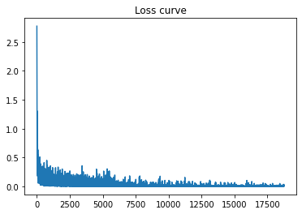
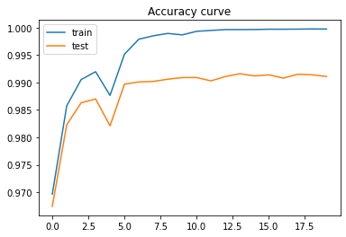

# A NumPy-based CNN Implementation

This is a **Pythonic** and concise CNN implementation based on NumPy package. NumPy's broadcasting feature is utilized as much as possible to avoid inefficient loops in python. 

To be precise, I have successfully get rid of loops in CNN modules except for the im2col (happens in both forward and backward of conv and pool layers) and col2im (happens in backward path of conv and pool layers) operations. But amazingly, I find that even im2col and col2im functions can be implemented without python loops with some advanced features and functions in NumPy, but they will make the code quite hard to read (at least for me). If you are interested, [CNNNumpy-Fast](https://hackmd.io/@bouteille/B1Cmns09I#Convolutional-Neural-Network-with-Numpy-Fast) introduces the implementation without any python loops. 

Although the NumPy implementation is still much slower than PyTorch, it is a good way to practice one's understanding in CNN models.

### Content

1. Layers
    - `Conv2d`
    - `Linear`
    - `ReLU`
    - `MaxPool2d`
    - `AvgPool2d`
    - `AvgPool2d_fast`
2. Criterion
    - `CrossEntropy`
3. Optimizer
    - `SGD` with momentum and L2 regularization
4. Model
    - `LeNet`
5. Gradient Checker
6. Test Dataset
    - MNIST

### Requirements

- Python 3
- NumPy
- PyTorch (only in PyTorch experiments)
- Matplotlib

### Experimentation

#### Dataset

MNIST, with 60k training images and 10k testing images. I pre-processed them to be zero mean and unit variance.

#### Hyperpameters

- Learning rate: 2e-2
- Batch size: 64
- Training epoch: 20
- Weight decay: 1e-4
- SGD momentum: 0.9
- LR attenuation: multiply 0.3 every 6 epochs.
- Initialization
  - Weight: Kaiming_normal
  - Bias: zero
- PyTorch implementation: everything is same as above.

#### Results

- With average pooling

| Framework | Train Accuracy | Test Accuracy |
| --------- | -------------- | ------------- |
| NumPy     | 0.9998         | 0.9911        |
| PyTorch   | 0.9997         | 0.9922        |

- With max pooling

| Framework | Train Accuracy | Test Accuracy |
| --------- | -------------- | ------------- |
| NumPy     | 0.9994         | 0.9893        |
| PyTorch   | 0.9997         | 0.9885        |

- Time

| Framework     | Training Time (s) | Inference Time (s) |
| ------------- | ----------------- | ------------------ |
| NumPy (CPU)   | 2058.3            | 14.666             |
| PyTorch (CPU) | 78.4              | 0.891              |
| PyTorch (GPU) | 33.2              | 0.057              |

Here the inference time measures how long it takes to evaluate the whole training set (60k images). The NumPy implementation is around 25x slower than the PyTorch one on CPU. Even without any python loops, [CNNNumpy-Fast](https://hackmd.io/@bouteille/B1Cmns09I#Convolutional-Neural-Network-with-Numpy-Fast) reports to be about 6x slower than PyTorch. We can conclude that it is really a bad idea to use NumPy for CNN implementation in practice.

#### Curves

Curves with NumPy implementation and `AvgPool2d_fast` pooling layer.

**Loss Curve**

**Accuracy Curves**

